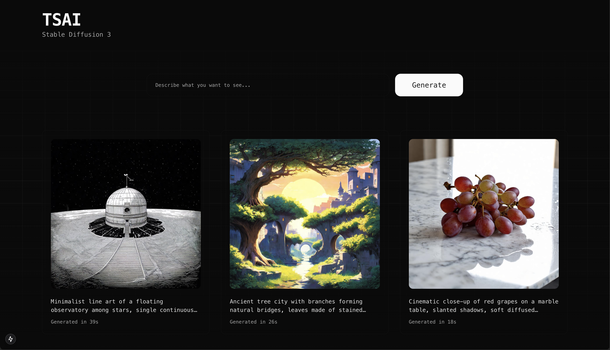

# TSAI Stable Diffusion 3 UI

A modern web interface for Stable Diffusion 3 text-to-image generation, built with Next.js and FastAPI.




## Project Structure

```
.
├── .              # Next.js frontend
├── model-server/        # FastAPI and TorchServe backend
│   ├── server.py       # FastAPI server
│   ├── config.properties
│   └── sd3_handler.py  # TorchServe handler
└── README.md
```

## Quick Start

### 1. Setting up the Frontend (sd3-ui)

```bash
cd sd3-ui
npm install
npm run dev
```

The UI will be available at http://localhost:3000

### 2. Setting up the Backend

#### 2.1 Preparing the Model

First, download the Stable Diffusion 3 model:

```bash
cd model-server
```

```python
#!/usr/bin/env python3
from diffusers import StableDiffusion3Pipeline
import torch

pipe = StableDiffusion3Pipeline.from_pretrained(
    "stabilityai/stable-diffusion-3-medium-diffusers", 
    torch_dtype=torch.bfloat16
)
pipe.save_pretrained("./sd3-model")
```

Then zip the model artifacts:

```bash
cd sd3-model
zip -0 -r ../sd3-model.zip *
```

#### 2.2 Creating the Model Archive (.mar)

Start a TorchServe container:

```bash
docker run -it --rm --shm-size=1g \
    --ulimit memlock=-1 \
    --ulimit stack=67108864 \
    --gpus all \
    -v `pwd`:/opt/src \
    pytorch/torchserve:0.12.0-gpu bash
```

Create the model archive:

```bash
cd /opt/src
torch-model-archiver --model-name sd3 \
    --version 1.0 \
    --handler sd3_handler.py \
    --extra-files sd3-model.zip \
    -r requirements.txt \
    --archive-format zip-store
```

#### 2.3 Starting TorchServe

```bash
docker run --rm --shm-size=1g \
    --ulimit memlock=-1 \
    --ulimit stack=67108864 \
    -p8080:8080 \
    -p8081:8081 \
    -p8082:8082 \
    -p7070:7070 \
    -p7071:7071 \
    --gpus all \
    -v /path/to/config.properties:/home/model-server/config.properties \
    --mount type=bind,source=/path/to/models,target=/tmp/models \
    pytorch/torchserve:0.12.0-gpu \
    torchserve --model-store=/tmp/models
```

#### 2.4 Starting the FastAPI Server

Install requirements:

```bash
pip install -r requirements-server.txt
```

Start the server:

```bash
cd model-server
python server.py
```

The FastAPI server will be available at http://localhost:9080

## Features

- 🎨 Modern, responsive UI with dark mode
- 🖼️ Real-time generation progress
- 💾 Local storage for generated images
- ⬇️ Download generated images
- 🗑️ Delete unwanted generations
- ⏱️ Generation time tracking

## Environment Variables

Create a `.env.local` file in the sd3-ui directory:

```env
BACKEND_URL=http://localhost:9080
```

## API Endpoints

- `POST /text-to-image`: Generate image from text prompt
- `GET /results/{job_id}`: Get generation results
- `GET /health`: Health check endpoint

## Requirements

### Frontend
- Node.js 22
- npm or yarn

### Backend
- Python 3.11+
- CUDA-compatible GPU
- Docker
- See `requirements-server.txt` for Python packages

## Development

The frontend uses Next.js 15 with App Router and is styled using Tailwind CSS and shadcn/ui components. The backend uses FastAPI for the API server and TorchServe for model serving.

## License

MIT

## Contributing

Contributions are welcome! Please feel free to submit a Pull Request.
